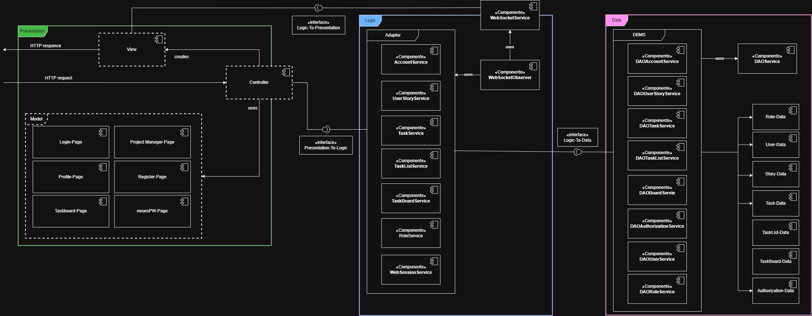
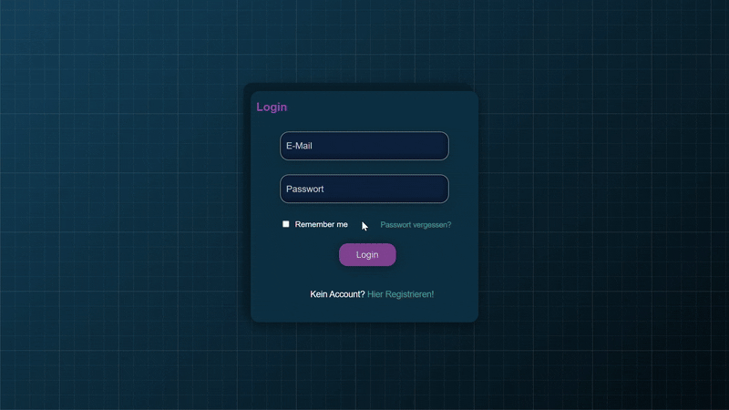
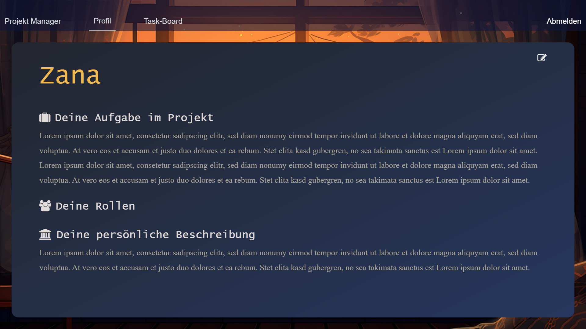
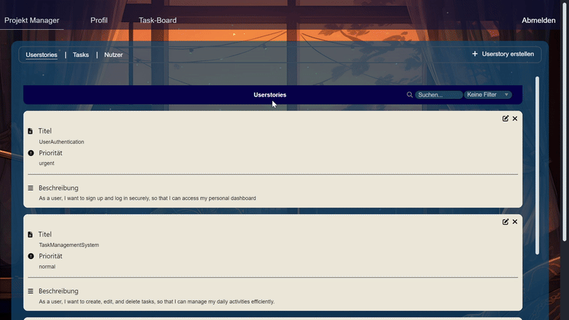
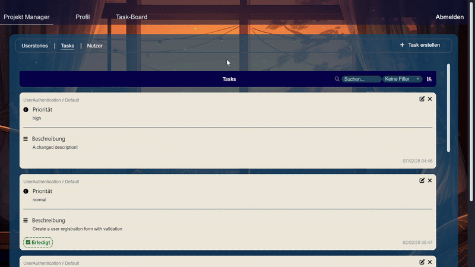
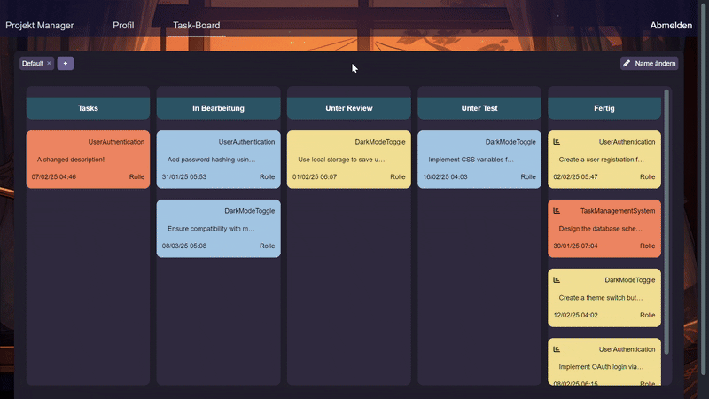

<h1 align="center">Scrum Board</h1>
<div align="center">
  
| ⚠️ Disclaimer |
|------------|
|This project was made for a university course. At the time, me and my colleagues barely had any knowledge of web development nor about frontend (this project was created with no frontend framework and everything used was self-taught), so - to the reader of this - don't expect best pratices and or a completely responsive web design. Hence why this was more of a "playground" to learn. Main focus of the course was to work in a self-created agile environment as a team and solve the requirements we were given. Nontheless, the product that came out was solid and we're proud of it!|

  
[![Unlicense License][license-shield]][license-url]
</div>
<details>
  <summary>Table of Contents</summary>
  <ol>
    <li><a href="#about-the-project">About the project</a></li>
    <li><a href="#rough-structural-diagram">Rough structural diagram</a></li>
    <li><a href="#build-with">Build with</a></li>
    <li><a href="#main-features">Main features</a></li>
    <li><a href="#additional-features">Additional features</a></li>
    <li><a href="#how-to-use">How to use</a></li>
  </ol>
</details>

## About the project
a Scrum Board is a project management tool that helps visualize and manage work, most commonly used in software development. It enables teams to track progress and organize tasksin an <a href="https://en.wikipedia.org/wiki/Agile_software_development">agile development process</a>. This project provides a digital Scrum Board with features that are discussed in more detail in <a href="#main-features">Main features</a>
 
## Rough structural diagram


## Build with
[![Java][Java]][Java-url]
[![HTML][HTML]][HTML-url]
[![JavaScript][JavaScript]][JavaScript-url]
[![SQLite][SQLite]][SQLite-url]
[![Hibernate][Hibernate]][Hibernate-url]
[![SpringBoot][SpringBoot]][SpringBoot-url]
[![Mockito][Mockito]][Mockito-url]

## Main features 
- **User management**
  - *Registration:* register a new user account
  - *Login:* login with your account
  - *Personalization:* change basic info about you

<table>
  <tr>
    <td width="50%"></td>
    <td width="50%"></td>
  </tr>
</table>

- **Project Management**
  - User Storys: create, delete and edit (CDE)
  - Tasks: CDE; assign to User Story and Task Board; visualize Estimation tracker for all tasks
  - Roles: create and assign roles to existing users (restricted to admins and project owners)
  - Filter: filter User Storys, Tasks and Tasks to User Storys by priority (low, normal, high, urgent) or state (done or not done)
  - Search: search User Storys, Tasks and Tasks to User Storys by name or description

<table>
  <tr>
    <td width="50%"></td>
    <td width="50%"></td>
  </tr>
</table>

- **Task Board**
  - Task Board instance: categorize tasks in different boards (can be created/deleted besides the default one); tasks are shown in the assigned Task Board
  - Task Board columns: categorize tasks in states (In Progress, Under Review, Under Test, Done)
  - Estimation tracker: if a task is moved to done, visualize the estimated time vs the actual time needed with a conclusion sentence

<table align="center">
  <tr>
    <td width="100%"></td>
  </tr>
</table>

## Additional features
- **Synchronization:** if a client uses the application, changes get synchronized with others
- **Multi-user:**  allows multiple clients to run the application simultaneously 

## How to use
**Requirements:** Java 17, Maven and support for the languages listed in <a href="#build-with">Build with</a> by the IDE
1. Clone the repository
```sh
git clone https://github.com/Zatzi08/ScrumBoard.git
cd ScrumBoard
```
2. Build the project with
```sh
mvn spring-boot:run
```
3. Go into your preferred browser to <a href="http://localhost:8080/">localhost</a> (port: 8080)

## TODO:
- [ ] set up a Docker

<!-- MARKDOWN LINKS & IMAGES -->
[Java]: https://img.shields.io/badge/Java-ED8B00?style=for-the-badge&logo=openjdk&logoColor=white
[Java-url]: https://www.java.com/download/ie_manual.jsp
[HTML]: https://img.shields.io/badge/HTML5-E34F26?style=for-the-badge&logo=html5&logoColor=white
[HTML-url]: https://developer.mozilla.org/en-US/docs/Web/HTML
[JavaScript]: https://img.shields.io/badge/JavaScript-F7DF1E?style=for-the-badge&logo=JavaScript&logoColor=333
[JavaScript-url]: https://developer.mozilla.org/en-US/docs/Web/JavaScript
[SQLite]: https://img.shields.io/badge/SQLite-003B57?style=for-the-badge&logo=SQLite&logoColor=white
[SQLite-url]: https://www.sqlite.org/
[Hibernate]: https://img.shields.io/badge/Hibernate-59666C?style=for-the-badge&logo=Hibernate&logoColor=white
[Hibernate-url]: https://hibernate.org/
[SpringBoot]: https://img.shields.io/badge/SpringBoot-6DB33F?style=for-the-badge&logo=Spring&logoColor=white
[SpringBoot-url]: https://spring.io/projects/spring-boot
[Mockito]: https://img.shields.io/badge/Mockito-5.11.0-blue?style=for-the-badge&logoColor=white
[Mockito-url]: https://site.mockito.org/
[license-shield]: https://img.shields.io/github/license/othneildrew/Best-README-Template.svg?style=for-the-badge
[license-url]: https://github.com/Zatzi08/ScrumBoard/blob/main/LICENSE
